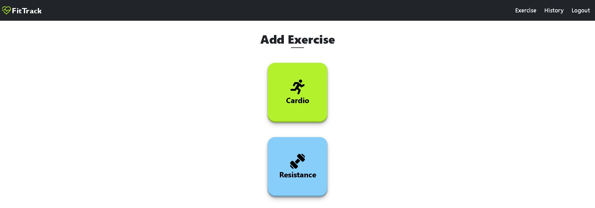
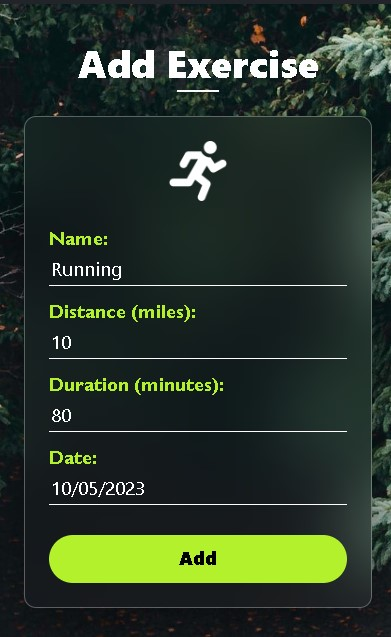
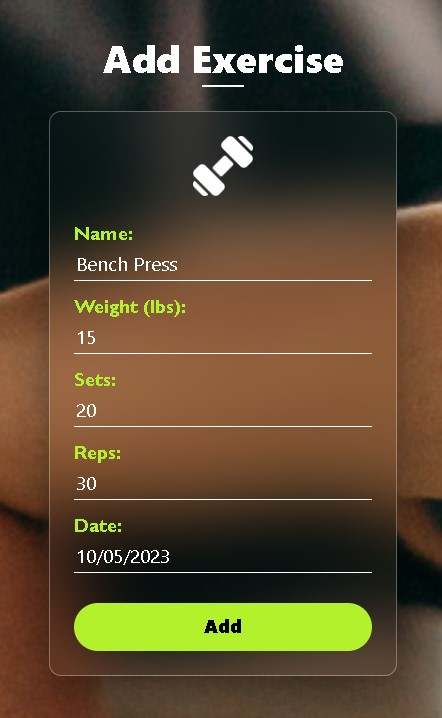
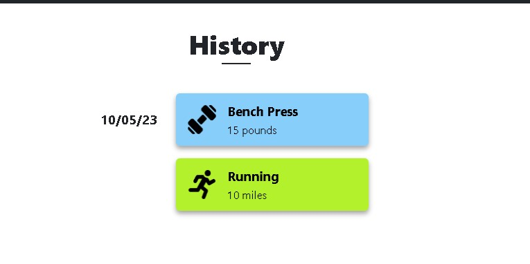
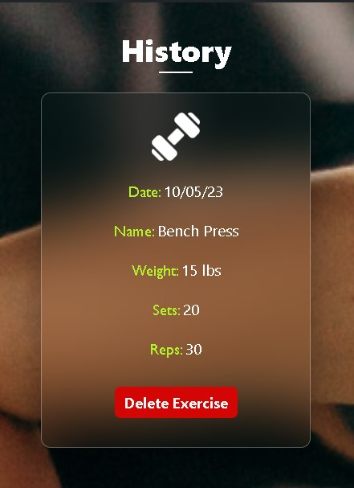
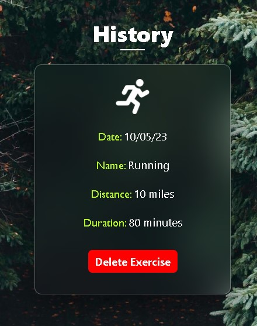

# FitTrack

A MERN-stack fitness tracker Web-application.

## Table of Contents

- [Description](#description)
- [Technology](#Technology)
- [Installation](#installation)
- [Usage](#usage)
- [Questions](#questions)

## Description:

A user-friendly MERN-stack Web-application that enables individuals to easily track and manage their daily fitness routines. Features include logging and tracking of both cardio and resistance exercises, viewing of workout history, and ability to delete exercises.

## Technology:

Project is created with:

- Mongoose
- Express.js
- React.js
- Node.js
- JWT Authentication

## Installation

To run this project, install it locally using npm:

```
npm install
```

## Usage

After installing npm packages, the application will be invoked by using the following command:

```
npm run develop
```

#### Example Screenshot

- Home Page <br>
  

- Login Page <br>
  

- Exercise Page <br>
  

- Add Cardio <br>
  

- Add Resistance <br>
  

- History Page <br>
  

- Single Cardio History <br>
  

- Single Resistance History <br>
  

## Questions?

Please feel free to contact me if you need any further information:

- [Email](dhrupalmavani@gmail.com)
- [Github Profile](https://github.com/dhrupal0033)
